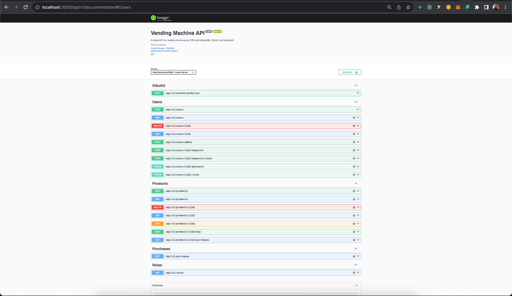

# Vending Machine
<p>
This is a very simple vending machine application that allows sellers to create products, and buyers to purchase products, and admin users to manage products and users. It is built using TypeScript, Express, and MongoDB. It also uses my <a href="https://www.npmjs.com/package/tspa" target="_blank">TSPA</a> library for data persistence.
<br>
Certain aspects of this application were written to demonstrate the power of <a href="https://www.npmjs.com/package/tspa" target="_blank">TSPA</a>. I created <a href="https://www.npmjs.com/package/tspa" target="_blank">TSPA</a> as a simple, lightweight, and easy-to-use library for creating and managing persistent data in a TypeScript application (think of JPA but for TypeScript).
</p>

## Run the application
In order to start the application please ensure that you have the following installed:
- Node.js
- Yarn
- Docker
- Docker Compose

To run the application, follow the following steps:
```sh
git clone https://github.com/anietieasuquo/vending-machine.git
cd vending-machine
yarn run start:docker # This will start the application in a docker container and should automatically open the Swagger UI in your default browser at http://localhost:3000/api/v1/documentation.
```



> Note: After running the application for the first time, ensure that you copy the clientId and clientSecret
from `~/vending-machine/vending-machine.json` (if running locally).
You will need them for authentication. client id and client secret are issued for each client which in this case is the
vending machine.
When the application runs for the first time, a default client and roles are created using the values of the environment
variables `DEFAULT_ADMIN_USERNAME`, `DEFAULT_ADMIN_PASSWORD` and `DEFAULT_VENDING_MACHINE_NAME` which are stored in
the `.env` file in the project directory.
If running from a docker container, you can search in the container logs for "Startup data stored in" to get the path to
the startup data file where the client id and client secret amongst other data are stored (most likely
in `/root/vending-machine/vending-machine.json`).

> Note: On the Swagger UI you don't need to use the authorization endpoint directly, you can use the `Authorize` button in the top right corner of the Swagger UI to authenticate and obtain an access token.

## API Endpoints
> Note that unless stated otherwise, all endpoints are protected by OAuth2 authentication and authorization.
The application has the following endpoints:
> - `POST /api/v1/oauth2/authorize`: This endpoint is used to authenticate a user and obtain an access token.
> - `POST /api/v1/users`: To create a user (unprotected).
> - `POST /api/v1/users/admin`: To create an admin user (protected - only used by admin users).
> - `GET /api/v1/users`: To get all users (protected - only used by admin users).
> - `GET /api/v1/users/{userId}`: To get a user by id (protected - a user can only get their own account).
> - `POST /api/v1/users/{userId}/deposits`: To make a deposit for a user by id (protected - for buyers - a user can only deposit into their own account).
> - `POST /api/v1/users/{userId}/deposits/reset`: To reset deposit for a user by id (protected - for buyers - a user can only reset on their own account).
> - `PATCH /api/v1/users/{userId}/password`: To change a user's password (protected - a user can only change their own password).
> - `PATCH /api/v1/users/{userId}/roles`: To change a user's role (protected - only used by admin users).
> - `DELETE /api/v1/users/{userId}`: To delete a user (protected - a user can only delete their own account).
> - `POST /api/v1/products`: To create a product (protected - only used by sellers).
> - `GET /api/v1/products`: To get all products (protected - used by all users).
> - `GET /api/v1/products/{productId}`: To get a product by id (protected - used by all users).
> - `POST /api/v1/products/{productId}/buy`: To buy a product by id (protected - used by buyers).
> - `PUT /api/v1/products/{productId}`: To update a product by id (protected - for sellers - a seller can only update their own product).
> - `DELETE /api/v1/products/{productId}`: To delete a product by id (protected - for sellers - a seller can only delete their own product).
> - `GET /api/v1/products/{productId}/purchases`: To get all purchases of a product by id (protected - for sellers - a seller can only get purchases for their own product).
> - `GET /api/v1/purchases`: To get all purchases (protected - only used by admin users).
> - `GET /api/v1/roles`: To get all roles (protected - only used by admin users).


## TESTS

To run all tests, run the following command:

```sh
yarn run test:all
```

## Notes:
- The application runs on port 3000 by default. You can change this by setting the `PORT` environment variable.
- You might be wondering why there are so many DTOs --well, if we're dealing with a high-stakes environment where
  security is crucial, we can't risk accidentally exposing sensitive data from one layer or module to the other. This is
  why we have to be explicit about what we're doing, with no room for ambiguities or assumptions.
- You might wonder why the files in `src/types` have `.ts` file extensions instead of `.d.ts`, --these files were renamed to `.ts` to avoid the need to manually copy them into the final build. This is because TypeScript automatically includes `.ts` files in the build, but not `.d.ts` files.
- Due to time constraints, I couldn't handle Idempotency, but in a real-world scenario I would have handled it.
- You might wonder why we still require `role` when creating an admin user, well, for security reasons, we want to make
  sure that the user is created with the right role, also for future-proofing --since we might want to add more
  potential roles in the future for different purposes.
- You might wonder why we have the `mongo-setup` container, well, that's a workaround to create the replica sets which is required for transactional sessions. Couldn't get
  it to work any other way and couldn't expend any more time to it, perhaps I'll look at it again at some point.
- This was done assuming that upon a successful purchase, the machine would dispense the user's change --that's why we
  reset the user's deposit to zero after successful change. If the machine would not dispense the change, we would have to
  keep the user's balance until the machine calls the `/reset` endpoint to reset user deposit`.
- Optimistic lock is used to handle concurrent requests to the same resource. This is done using the TSPA library which
  supports optimistic lock out of the box.
- I'm not a fan of using verbs or actions in endpoint names as that violates Richardson Maturity Models for REST APIs, but
  I did it here for sake of requirements and simplicity, but in a real world scenario I would've
  preferred to use `POST /product/{productId}` or `POST /purchases` (if more than one product could be bought) for making a purchases instead of `POST /product/{productId}/buy` in order
  to maintain a resource-oriented approach.
- The test coverage is not 100% due to time constraints as this is strictly for demonstration purposes only. In a real-world
  scenario, I would have aimed for 100% test coverage.
- The application could easily be modified so that a user can have more than one role, but for simplicity, I've assumed that a
  user can only have one role.
- The reason we're accepting role name and machine name from users instead of `roleId` and `machineId` is for the sake of convenience, and also to prevent unauthorized users from needing access to role and machine information beforehand.
- When a seller is created, the deposit amount is set to 0 to avoid compromising the integrity of the system. This is because the deposit amount is only relevant to the buyer users. This can be changed if users can have more than one role.
- When deleting a seller, should we also delete the products they created? This is a question that would need to be answered in a real-world scenario. For accounting purposes I've assumed that the products would stay since we're doing soft-delete anyway.

## Author

👤 **Anietie Asuquo <hello@anietieasuquo.com>**

* Website: https://anietieasuquo.com
* Twitter: [@anietieasuquo](https://twitter.com/anietieasuquo)
* Github: [@anietieasuquo](https://github.com/anietieasuquo)
* LinkedIn: [@anietieasuquo](https://linkedin.com/in/anietieasuquo)
